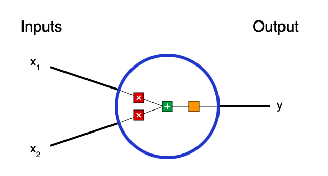
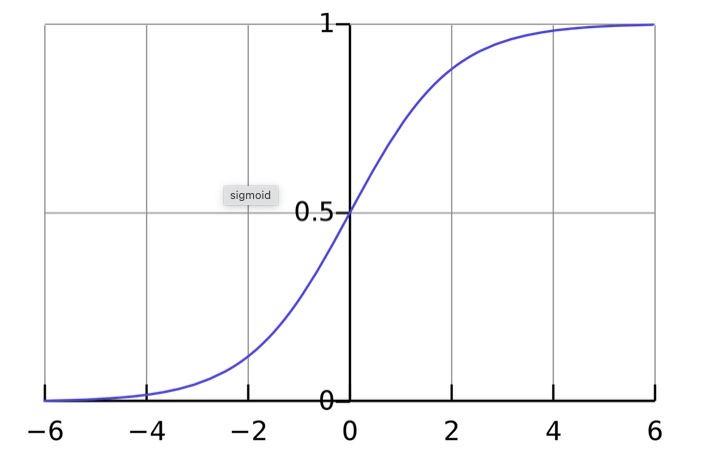
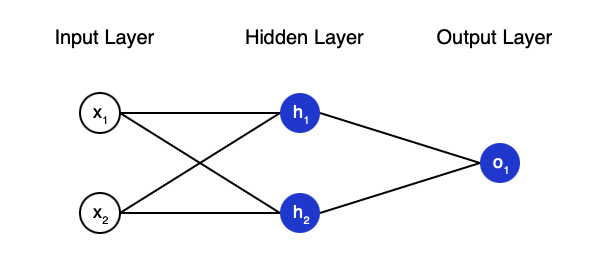
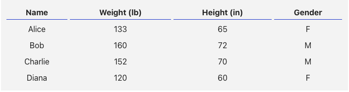
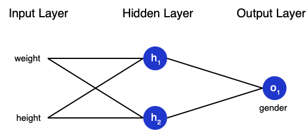
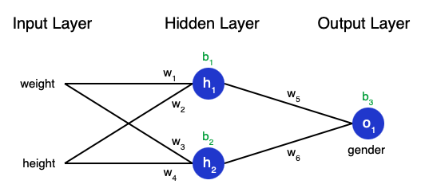
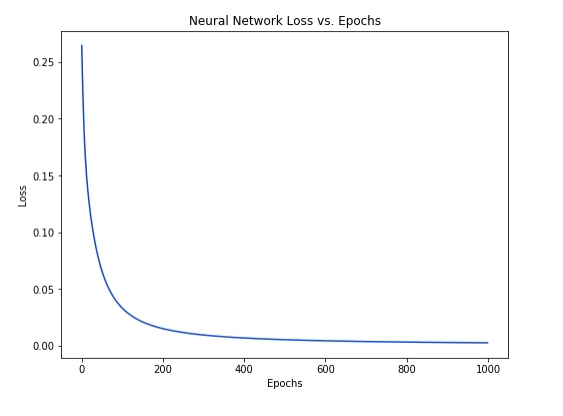

Neural Networks aren’t that complicated! The term “neural network” gets used as a buzzword a lot, but in reality they’re often much simpler than people imagine.

**Neurons**


A neuron is the basic unit of a neural network. A neuron takes inputs, does some math with them, and produces one output. Here’s what a 2-input neuron looks like:



3 things are happening here. 

First, each input is multiplied by a weight:

$$ x_{1} \longrightarrow x_{1} * w_{1} \\x_{2} \longrightarrow x_{2} * w_{2}  $$

Next, all the weighted inputs are added together with a bias b

$$ (x_{1} * w_{1}) + (x_{2} * w_{2}) + b $$

Finally the result is passes to the activation function:

$$ y = f((x_{1} * w_{1}) + (x_{2} * w_{2}) + b) $$

The activation function is used to turn an unbounded input into an output that has a nice, predictable form. A commonly used activation function is the sigmoid function:



In Numpy, we have:

```python
import numpy as np

def sigmoid(x):
  # Our activation function: f(x) = 1 / (1 + e^(-x))
  return 1 / (1 + np.exp(-x))

class Neuron:
  def __init__(self, weights, bias):
    self.weights = weights
    self.bias = bias

  def feedforward(self, inputs):
    # Weight inputs, add bias, then use the activation function
    total = np.dot(self.weights, inputs) + self.bias
    return sigmoid(total)

weights = np.array([0, 1]) # w1 = 0, w2 = 1
bias = 4                   # b = 4
n = Neuron(weights, bias)

x = np.array([2, 3])       # x1 = 2, x2 = 3
print(n.feedforward(x))    # 0.9990889488055994

```


**Neurons in a Neural Net**

A neural network is nothing more than a bunch of neurons connected together:



This network has 2 inputs, a hidden layer with 2 neurons ( $$h_{1}$$ and $$h_{2}$$ ) and an output layer with 1 neuron ( $$\sigma_{1}$$). Notice that the inputs for $$\sigma_{1}$$ are the outputs from $$h_{1}$$ and $$h_{2}$$ , that’s what makes this a network.


```python
import numpy as np

# ... code from previous section here

class OurNeuralNetwork:
  '''
  A neural network with:
    - 2 inputs
    - a hidden layer with 2 neurons (h1, h2)
    - an output layer with 1 neuron (o1)
  Each neuron has the same weights and bias:
    - w = [0, 1]
    - b = 0
  '''
  def __init__(self):
    weights = np.array([0, 1])
    bias = 0

    # The Neuron class here is from the previous section
    self.h1 = Neuron(weights, bias)
    self.h2 = Neuron(weights, bias)
    self.o1 = Neuron(weights, bias)

  def feedforward(self, x):
    out_h1 = self.h1.feedforward(x)
    out_h2 = self.h2.feedforward(x)

    # The inputs for o1 are the outputs from h1 and h2
    out_o1 = self.o1.feedforward(np.array([out_h1, out_h2]))

    return out_o1

network = OurNeuralNetwork()
x = np.array([2, 3])
print(network.feedforward(x)) # 0.7216325609518421

```

**Training** 

Say we have the following measurements:



Let’s train our network to predict someone’s gender given their weight and height:




Let $$ 0 $$ be a male and $$ 1 $$ a female.


**Loss**

Before we train our network, we first need a way to quantify how “good” it’s doing so that it can try to do “better”. That’s what the loss is : 

$$ MSE = \frac{1}{n} \sum_{i=1}^{n} (y_{true} - y_{pred}) ^ 2 $$

MSE stands for mean squared error.

-  $$n $$ is the number of samples, which is 4 (Alice, Bob, Charlie, Diana).
- $$ y $$ represents the variable being predicted, which is Gender
- $$ y_{true} $$ is the true value of the variable (the “correct answer”). For example, 
    $$ y_{true} $$ for Alice would be 1.
- $$ y_{pred} $$ is the predicted value of the variable. It’s whatever our network outputs.

$$ (y_{true} - y_{pred}) ^ 2 $$ is the squared error. Our loss function is simply taking the average over all squared errors (hence the name mean squared error). The better our predictions are, the lower our loss will be!

In Numpy:

```python
import numpy as np

def mse_loss(y_true, y_pred):
  # y_true and y_pred are numpy arrays of the same length.
  return ((y_true - y_pred) ** 2).mean()

y_true = np.array([1, 0, 0, 1])
y_pred = np.array([0, 0, 0, 0])

print(mse_loss(y_true, y_pred)) # 0.5

```
Let’s label each weight and bias in our network:



We can therefore write the Loss Function as:

$$ L(w_{1},w_{2},w_{3},w_{4},w_{5},w_{6},b_{1},b_{2}) $$

What we want is, for every little tweak in each variable, we want the minimal loss possible. We can calculate variation of the loss function regarding the weights by using the chain rule:

$$ \frac{\partial L }{\partial w_{i}} = \frac{\partial L }{\partial y_{pred}} * \frac{\partial y_{pred} }{\partial h_{i} } * \frac{\partial h_{i} }{\partial w_{i}} $$ 

For our problem, lets take just the femaels predictions. We have :

$$ \frac{\partial L }{\partial y_{pred}} = \frac{\partial (y_{true} - y_{pred}) ^ 2  }{\partial y_{pred}}  =  -2 * (1 - y_{pred})$$ 


$$  \frac{\partial y_{pred} }{\partial h_{1} } = w_{5} * f^{\prime}(w_{5} *h_{1} + w_{6} * h_{2} + b_{3}) $$

Finally, 

$$ h_{1} = f(w_{1} * x_{1} + w_{2} * x_{2} + b_{1}) $$

$$ \frac{\partial h_{1} }{\partial w_{1}} = x1 * f^{\prime}(w_{1} * x_{1} + w_{2} * x_{2} + b_{1}) $$

For the Sigmoid function :

 $$ f^{\prime} = f(x) * (1 - f(x)) $$

 And thats it ! This backwards calculation of the chain rule is also known as **backpropagation**. 

 So, for every prediction, we can create a **series of prediciton**. Based on the last predicion, we can get better and better prediction until our Loss Function is small enough. For such iteration, the weight is updated as the following:


$$ w_{1} \longleftarrow w_{1} - \theta * \frac{\partial L}{\partial w_{1}} $$

This makes sense because $$ \frac{\partial L}{\partial w_{1}} $$ is the direction of maximal variation o $$ L $$ regarding $$ w_{1} $$ , so taking the minus sign, we aiming towards the minimum. The $$ \theta $$ parameter is known as the **learning rate**, and dictates how fast we train.

And therefore, we have the final code:

```python
import numpy as np

def sigmoid(x):
  # Sigmoid activation function: f(x) = 1 / (1 + e^(-x))
  return 1 / (1 + np.exp(-x))

def deriv_sigmoid(x):
  # Derivative of sigmoid: f'(x) = f(x) * (1 - f(x))
  fx = sigmoid(x)
  return fx * (1 - fx)

def mse_loss(y_true, y_pred):
  # y_true and y_pred are numpy arrays of the same length.
  return ((y_true - y_pred) ** 2).mean()

class OurNeuralNetwork:
  
  def __init__(self):
    # Weights
    self.w1 = np.random.normal()
    self.w2 = np.random.normal()
    self.w3 = np.random.normal()
    self.w4 = np.random.normal()
    self.w5 = np.random.normal()
    self.w6 = np.random.normal()

    # Biases
    self.b1 = np.random.normal()
    self.b2 = np.random.normal()
    self.b3 = np.random.normal()

  def feedforward(self, x):
    # x is a numpy array with 2 elements.
    h1 = sigmoid(self.w1 * x[0] + self.w2 * x[1] + self.b1)
    h2 = sigmoid(self.w3 * x[0] + self.w4 * x[1] + self.b2)
    o1 = sigmoid(self.w5 * h1 + self.w6 * h2 + self.b3)
    return o1

  def train(self, data, all_y_trues):
    '''
    - data is a (n x 2) numpy array, n = # of samples in the dataset.
    - all_y_trues is a numpy array with n elements.
      Elements in all_y_trues correspond to those in data.
    '''
    learn_rate = 0.1
    epochs = 1000 # number of times to loop through the entire dataset

    for epoch in range(epochs):
      for x, y_true in zip(data, all_y_trues):
        # --- Do a feedforward (we'll need these values later)
        sum_h1 = self.w1 * x[0] + self.w2 * x[1] + self.b1
        h1 = sigmoid(sum_h1)

        sum_h2 = self.w3 * x[0] + self.w4 * x[1] + self.b2
        h2 = sigmoid(sum_h2)

        sum_o1 = self.w5 * h1 + self.w6 * h2 + self.b3
        o1 = sigmoid(sum_o1)
        y_pred = o1

        # --- Calculate partial derivatives.
        # --- Naming: d_L_d_w1 represents "partial L / partial w1"
        d_L_d_ypred = -2 * (y_true - y_pred)

        # Neuron o1
        d_ypred_d_w5 = h1 * deriv_sigmoid(sum_o1)
        d_ypred_d_w6 = h2 * deriv_sigmoid(sum_o1)
        d_ypred_d_b3 = deriv_sigmoid(sum_o1)

        d_ypred_d_h1 = self.w5 * deriv_sigmoid(sum_o1)
        d_ypred_d_h2 = self.w6 * deriv_sigmoid(sum_o1)

        # Neuron h1
        d_h1_d_w1 = x[0] * deriv_sigmoid(sum_h1)
        d_h1_d_w2 = x[1] * deriv_sigmoid(sum_h1)
        d_h1_d_b1 = deriv_sigmoid(sum_h1)

        # Neuron h2
        d_h2_d_w3 = x[0] * deriv_sigmoid(sum_h2)
        d_h2_d_w4 = x[1] * deriv_sigmoid(sum_h2)
        d_h2_d_b2 = deriv_sigmoid(sum_h2)

        # --- Update weights and biases
        # Neuron h1
        self.w1 -= learn_rate * d_L_d_ypred * d_ypred_d_h1 * d_h1_d_w1
        self.w2 -= learn_rate * d_L_d_ypred * d_ypred_d_h1 * d_h1_d_w2
        self.b1 -= learn_rate * d_L_d_ypred * d_ypred_d_h1 * d_h1_d_b1

        # Neuron h2
        self.w3 -= learn_rate * d_L_d_ypred * d_ypred_d_h2 * d_h2_d_w3
        self.w4 -= learn_rate * d_L_d_ypred * d_ypred_d_h2 * d_h2_d_w4
        self.b2 -= learn_rate * d_L_d_ypred * d_ypred_d_h2 * d_h2_d_b2

        # Neuron o1
        self.w5 -= learn_rate * d_L_d_ypred * d_ypred_d_w5
        self.w6 -= learn_rate * d_L_d_ypred * d_ypred_d_w6
        self.b3 -= learn_rate * d_L_d_ypred * d_ypred_d_b3

      # --- Calculate total loss at the end of each epoch
      if epoch % 10 == 0:
        y_preds = np.apply_along_axis(self.feedforward, 1, data)
        loss = mse_loss(all_y_trues, y_preds)
        print("Epoch %d loss: %.3f" % (epoch, loss))

# Define dataset
data = np.array([
  [-2, -1],  # Alice
  [25, 6],   # Bob
  [17, 4],   # Charlie
  [-15, -6], # Diana
])
all_y_trues = np.array([
  1, # Alice
  0, # Bob
  0, # Charlie
  1, # Diana
])

# Train our neural network!
network = OurNeuralNetwork()
network.train(data, all_y_trues)

```

And we have the following plot:



```python

# Make some predictions
emily = np.array([-7, -3]) # 128 pounds, 63 inches
frank = np.array([20, 2])  # 155 pounds, 68 inches
print("Emily: %.3f" % network.feedforward(emily)) # 0.951 - F
print("Frank: %.3f" % network.feedforward(frank)) # 0.039 - M
```
