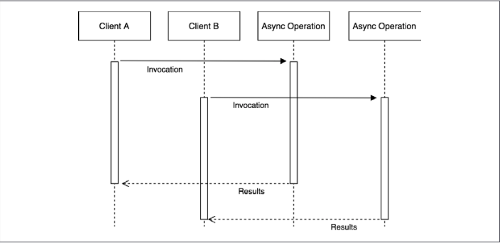
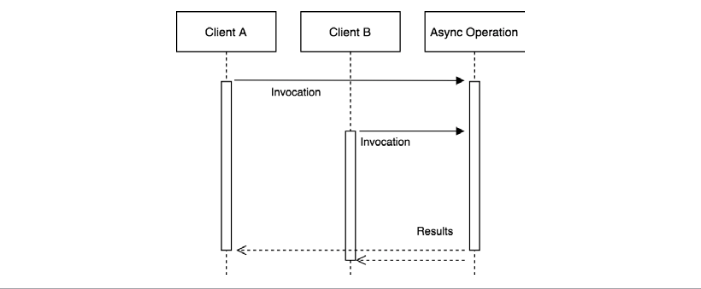

Caching plays a critical role in high load applications, and it's used almost everywhere on the web, from static resources such as web pages, images, and stylesheets, to pure data such as the result of database queries. 

**What's asynchronous request batching?**

When dealing with asynchronous operations, the most basic level of caching can be achieved by batching together a set of invocations to the same API. The idea is very simple: if we invoke an asynchronous function while there is still another one pending, we can piggyback on the already running operation instead of creating a brand new request. 
Take a look at the following diagram:



The previous diagram shows two clients invoking the same asynchronous operation with exactly the same input. Of course, the natural way to picture this situation is with the two clients starting two separate operations that will complete at two different moments.

Now, consider the following scenario:




The last figure shows us how two identical requests— which invoke the same API with the same input—can be batched, or in other words, appended to the same running operation. By doing this, when the operation completes, both clients are notified, even though the async operation is actually executed only once. This represents
a simple, yet extremely powerful, way to optimize the load of an application while not having to deal with more complex caching mechanisms, which usually require an adequate memory management and invalidation strategy.

**Optimal asynchronous request caching**

Request batching is less effective if the operation is fast enough or if matching requests are spread across a longer period of time. Also, most of the time, we can safely assume that the result of two identical API invocations will not change so often, so simple request batching will not provide the best performance. In all these circumstances, the best candidate to reduce the load of an application and increase its responsiveness is definitely a more aggressive caching mechanism.

The idea is simple: as soon as a request completes, we store its result in the cache, which can be an in-memory variable or an item in a specialized caching server (such as Redis). Hence, the next time the API is invoked, the result can be retrieved immediately from the cache, instead of spawning another request. 

The idea of caching should not be new to an experienced developer, but what makes this technique different in asynchronous programming is that it should be combined with request batching to be optimal. The reason for this is because multiple requests might run concurrently while the cache is not set and when those requests complete, the cache would be set multiple times.


Based on these assumptions, we can illustrate the Combined Request Batching and Caching pattern as follows:


- The first phase is totally identical to the batching pattern. Any request received while the cache is not set will be batched together. When the request completes, the cache is set, once.

- When the cache is finally set, any subsequent request will be served directly from it.

Since we are dealing with asynchronous APIs, we must be sure to always return the cached value asynchronously, even if accessing the cache involves only a synchronous operation, such as in the case in which the cached value is retrieved from an in-memory variable.

**An API server without caching or batching**

Let's consider an API server that manages the sales of an e-commerce company. In particular, we want to query our server for the sum of all the transactions of a particular type of merchandise. For this purpose, we are going to use a LevelUP database through the level npm package. The data model that we are going to use is a simple list of transactions stored in the sales sublevel (a subsection of the database), which is organized in the following format:

```
transactionId {amount, product}
```

The key is represented by transactionId and the value is a JSON object that contains the amount of the sale (amount) and the product type (product).

The data to process is really basic, so let's implement a simple query over the database that we can use for our experiments. Let's say that we want to get the total amount of sales for a particular product. The routine would look as follows 

```javascript
import level from 'level'
import sub from 'subleveldown'

const db = level('example-db')
const salesDb = sub(db,'sales',{valueEncoding: 'json'})

export async function totalSales(product){
    const now = Date.now()
    let sum = 0
    for await (const transaction of salesDb.createValueStream()) {
        if(!product || transaction.product == product) {
            sum += transaction.amount
        }
    }
    console.log(`totalSales() took: ${Date.now() - now}ms`)
    return sum
}
```

The totalSales() function iterates over all the transactions of the sales sublevel
and calculates the sum of the amounts of a particular product. The algorithm is intentionally slow as we want to highlight the effect of batching and caching later on. In a real-world application, we would have used an index to query the transactions by product or, even better, we could have used an incremental map/reduce algorithm to continuously calculate the sum for every product

We can now expose the totalSales() API through a simple HTTP server


```javascript
import { createServer } from 'http'
import { totalSales } from './totalSales.js'
createServer(async (req, res) => {
  const url = new URL(req.url, 'http://localhost')
  const product = url.searchParams.get('product')
  console.log(`Processing query: ${url.search}`)
  const sum = await totalSales(product)
  res.setHeader('Content-Type', 'application/json')
  res.writeHead(200)
  res.end(JSON.stringify({product,sum }))

}).listen(8000, () => console.log('Server started'))
```

Before we start the server for the first time, we need to populate the database with some sample data. We can do this with the following script, which creates 100,000 random sales transactions in the database so that our query spends some time crunching data:

```javascript
import level from 'level'
import sublevel from 'subleveldown'
import nanoid from 'nanoid'

const db = level('example-db')
const salesDb = sublevel(db, 'sales', { valueEncoding: 'json' })
const products = ['book', 'game', 'app', 'song', 'movie']

async function populate () {
  for (let i = 0; i < 100000; i++) {
    await salesDb.put(nanoid(), {
      amount: Math.ceil(Math.random() * 100),
      product: products[Math.floor(Math.random() * 5)]
    })
  }

  console.log('DB populated')
}

populate()
```
